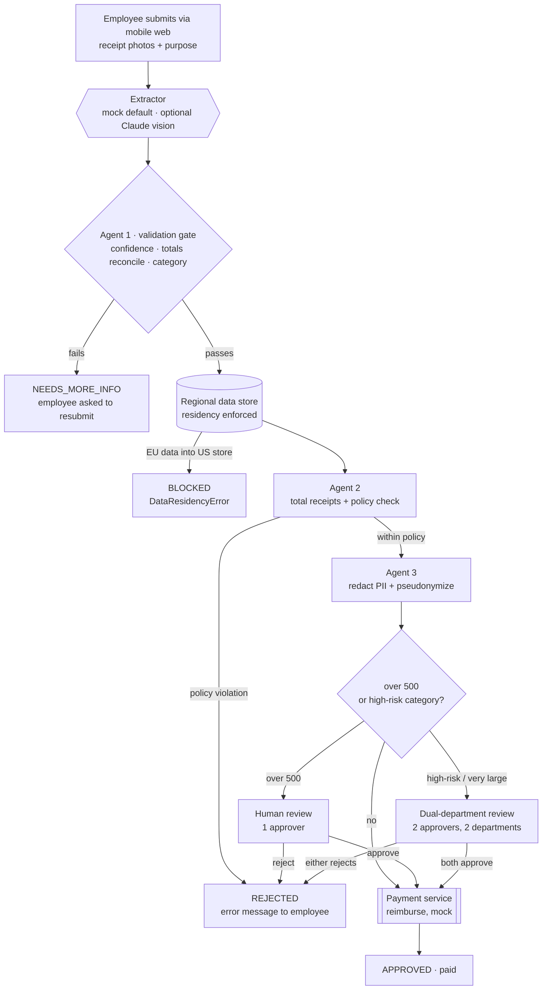

# Agentic Expense Reporting System

A runnable reference implementation of a three-agent expense-reporting
pipeline: extract receipts, check policy, decide and pay.

## How it works



The colored gates above map directly to the project answers: the **Agent 1
validation gate** is the Step 2 bug fix, **residency enforced** is Step 4,
**human review** is Step 3, and **dual-department review** is Step 5. See
[`docs/design.md`](docs/design.md) for the full code mapping.

## Who this is for

- **Developers** exploring a clean, dependency-free example of a multi-agent
  workflow with validation gates, human-in-the-loop review, and privacy controls.
- **Reviewers** of the companion analysis: every design claim is backed by code
  and a test. See [`docs/design.md`](docs/design.md).

## Requirements

Python 3.11+. No API keys, no cloud, no third-party runtime dependencies.

## Use it

```bash
make setup     # venv + editable install
make demo      # run every scenario end to end
make check     # ruff + pytest
```

Run a single scenario:

```bash
python -m expense_pipeline run examples/reports/large_trip.json
python -m expense_pipeline run examples/reports/blurry_receipt.json --no-validation  # reproduces the extraction bug
python -m expense_pipeline run examples/reports/gift_highrisk.json                   # dual-department approval
python -m expense_pipeline run examples/reports/eu_resident.json --region EU          # data-residency control
python -m expense_pipeline cost                                                       # cost-driver table
```

Optional real receipt extraction with Claude vision (otherwise a deterministic
mock is used):

```bash
pip install -e ".[real]"
export ANTHROPIC_API_KEY=...
```

## Layout

| Path | Purpose |
|---|---|
| `src/expense_pipeline/` | The pipeline (agents, privacy, policy, orchestrator, CLI). |
| `examples/` | Policy, org directory, sample reports and receipts. |
| `tests/` | Behavior tests, one file per capability. |
| `answers/responses.md` | Written system analysis. |
| `docs/design.md` | How the code maps to each design decision. |

See [`NOTICE.md`](NOTICE.md) for usage terms.
